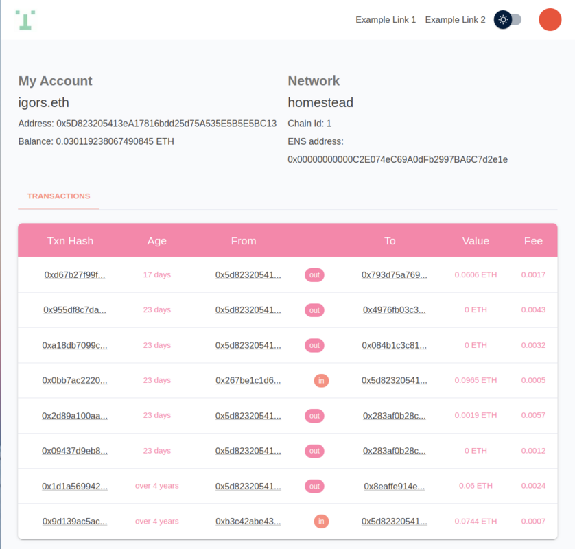

# Web3 Starter Kit

Web3 Starter Kit is flexible production grade **Web3** boilerplate with [Next.js 12](https://nextjs.org/blog/next-12), [React.js](https://reactjs.org/), [Material-UI](https://mui.com/), [Typescript](https://www.typescriptlang.org/) and [web3-react (beta)](https://github.com/NoahZinsmeister/web3-react). 

It's a user interface for your decentralized application. 

Includes wallet connection for most popular javascript [EIP-1193](https://eips.ethereum.org/EIPS/eip-1193) providers:
- [MetaMask](https://metamask.io/)
- [Coinbase Wallet](https://www.coinbase.com/wallet)
- [Wallet Connect](https://walletconnect.com/)
- Retrieval of users **latest transactions** from etherscan

Web3 Starter Kit is meant:
- to be used as **boilerplate** to quickly deploy new project
- to be used as **educational** resource
- to be **flexible** accomodating **easy customization**  

# Why

Finding out which web3 libraries work together is still a difficult job. Web3 Started Kit aims to boild down the complexity to simple configuration. 

## Preview



# Quick start

## Running locally in development mode

1. `git clone https://github.com/eth-salt-lake/dao-app.git` clones the Web3 Starter Kit repository   
2. `cd dao-app && git checkout main` checks out the desired branch
3. `cp env.local.example .env.local` prepares environment variables for development
4. `npm install` installs dependencies
5. `npm run dev` runs development server

That's it. The project should run on your local computer `http://localhost:3000`


# Features

- based om latest [Next.js](https://nextjs.org/)
- styling customization with [material design]((https://mui.com/))
- Wallet connections and current connected wallet caching with [web3-react (beta)](https://github.com/NoahZinsmeister/web3-react)
- state management with [redux-toolkit](https://github.com/reduxjs/redux-toolkit)
- [dotenv](https://github.com/motdotla/dotenv), and more...


# Guides

The Web3 app has 2 configurations. 
1. One for the API, which is used to communicate with etherscan to retrieve users latest transactions. (environment files: `.env.local`, `.env.production`)
2. One for the Frontend part which is used to configure to which wallets and which blockchains you'd like your users to interact with. (file: `config.ts`)

## API Configuration

In development create in the root folder file `.env.local`, for production `.env.production`: 

```
.env.local
.env.production
```

Contents:
```
APP_NAME=My Web3 Project Name
ETHERSCAN_API_KEY=mykey
ETHERSCAN_API_ENDPOINT=https://api-testnet.polygonscan.com/api
```

`APP_NAME`

Custom app name

`ETHERSCAN_API_KEY`

To request information directly from `etherscan` (or etherscan like service) you need an API key. For example for [etherscan.io](https://etherscan.io) go to: `https://etherscan.io/myapikey` and create one.  


`ETHERSCAN_API_ENDPOINT`

Check the documentation for an endpoint [here](https://docs.etherscan.io/getting-started/endpoint-urls). Or if you'd like to connect to L2 chain like [Polygon](https://polygon.technology/) then check the endpoints [here](https://docs.polygonscan.com/getting-started/endpoint-urls).  


## Frontend Configuration

```
root
|_config.ts
 ```

Contents: 
```
export const ETHERSCAN_URL = 'https://etherscan.io/';
export const NETWORK_COIN_SYMBOL = 'ETH';
export const DEFAULT_NETWORK_ID = 1; // check folder web/chain.ts for more network IDs
export const APP_NAME = "Web3 Started Kit"
export const DEFAULT_APP_THEME = 'light'; // light, dark
 ```

`ETHERSCAN_URL`

Base URl from the transactions table to etherscan for more details. 

`NETWORK_COIN_SYMBOL`

Display value for selected chains currency

`APP_NAME`

Custom app name. 

`DEFAULT_APP_THEME`

`light` or `dark`.

`DEFAULT_NETWORK_ID`

The selected network Web3 will communicate with.

Helper chain table:
| Chain ID | Network |
|----------|---------|
| 1        | Mainnet |
| 3        | Ropsten |
| 4        | Rinkeby |
| 5        | Goerli |
| 10       | Optimism |
| 42       | Kovan |
| 56       | BSC |
| 137      | Polygon |
| 42161    | Arbitrum One |
| 43114    | Avalanche |
| 80001    | Polygoin Mumbai |


## Usage - Web3 convenience methods

TO access Web3 method use our `web3 hook`: 

```javascript
const { connect, connectTo, disconnect, wallet } = useWeb3();
```

### `connect` and `connectTo`

The `connect` and `connectTo` are shortcuts to instantiate [web3modal](https://github.com/Web3Modal/web3modal) connection wizard. Most of the times this will be users first needed step to interact with your dApp.

`connect` allows user to connect to any blockchain. 

`connecTo` will ask user to switch or add the blockchain network you'd like user to connect to. connectTo required 1 parameter which you can find in `blockchains.ts` file. 

For further customization of web3modal please visit [web3modal GitHub](https://github.com/Web3Modal/web3modal#usage). 

### `disconnect`

Disconnects users wallet. 

### `wallet`

wallet holds connected wallets information. The structure is defined in folder `types`: 

```javascript
export interface MyWallet {
    address?: string;
    ensName?: string;
    avatar?: string;
}
```

### `provider`

Web3 Starter Kit is built on top of [ethers.js v5](https://docs.ethers.io/v5/). Ethers.js allows various interactions with Blockchains, such as sending transactions and interacting with your deployed contracts. 

Provider is an instance of `ethers.providers.Web3Provider` with an established connection to desired blockchain (see `Frontend configuration`). 

For full documentation on ethers.js please visit their [documentation page](https://docs.ethers.io/v5/api/). 


## API Endpoints

Endpoint for getting users latest transactions. 
```
|-- pages/api/transactions/[walletaddress].ts
```

## Styling with Material Design

TDB (Where to modify it)

## 
---

# Building and deploying in production

If you wanted to run this site in production, you should install modules then build the site with `npm run build` and run it with `npm run start`:

```
npm install
npm run build
npm run start
```

## Deploy on Vercel

The easiest way to deploy your Next.js app is to use the [Vercel Platform](https://vercel.com/new?utm_medium=default-template&filter=next.js&utm_source=create-next-app&utm_campaign=create-next-app-readme) from the creators of Next.js.

Check out our [Next.js deployment documentation](https://nextjs.org/docs/deployment) for more details.
